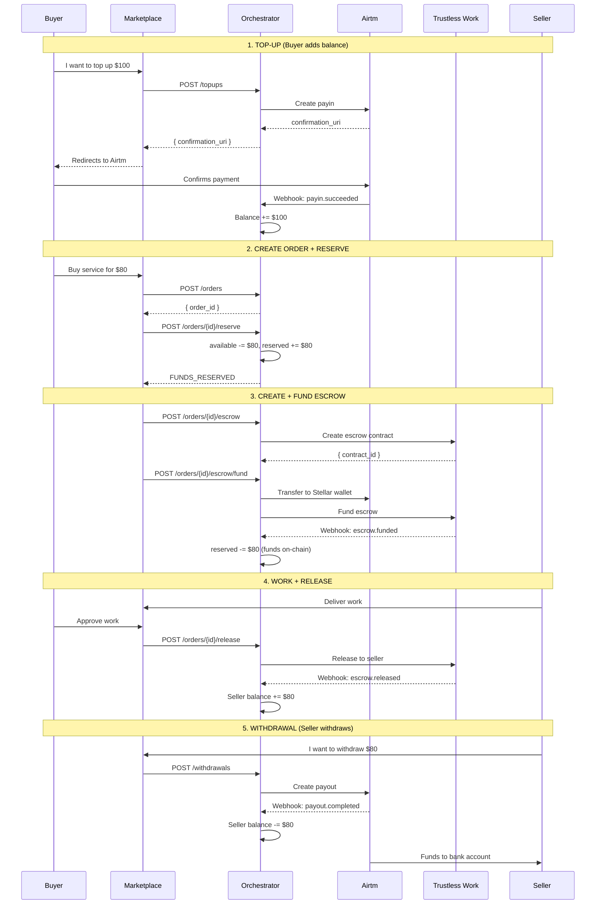
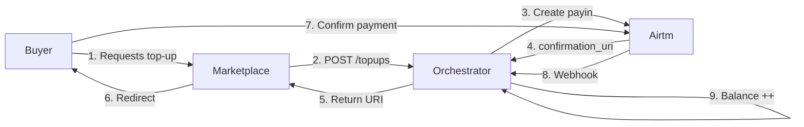
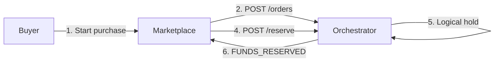
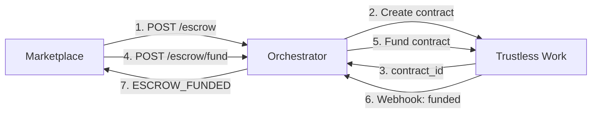
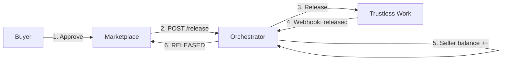
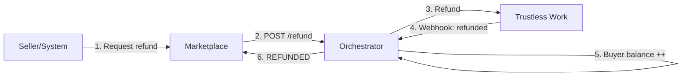
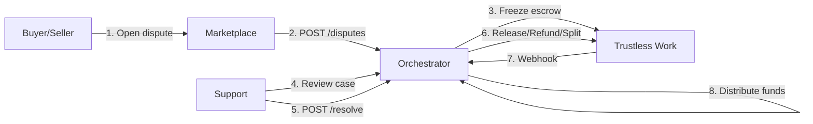
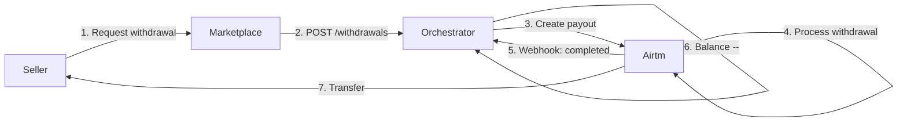

# Flow of Funds

## High-Level Diagram



## Phase Detail

### Phase 1: Top-up (Add Balance)

The buyer tops up their marketplace account balance.



**Money flow:**
- Buyer pays via payment method (card, transfer, etc.)
- Airtm receives fiat funds
- Buyer balance increases in the Orchestrator

**TopUp states:**
```
TOPUP_CREATED -> TOPUP_AWAITING_USER_CONFIRMATION -> TOPUP_PROCESSING -> TOPUP_SUCCEEDED
```

---

### Phase 2: Create Order + Reserve Funds

The buyer starts a purchase and funds are reserved.



**Money flow:**
- No real money movement
- Only a logical hold in the database
- `available -= amount`, `reserved += amount`

**Order states:**
```
ORDER_CREATED -> FUNDS_RESERVED
```

---

### Phase 3: Create and Fund Escrow

Reserved funds move to the non-custodial escrow.



**Money flow:**
- Orchestrator uses the buyer Airtm balance
- Transfers to a Stellar wallet
- Funds the smart contract in Trustless Work
- Funds are now locked on-chain

**Order states:**
```
FUNDS_RESERVED -> ESCROW_CREATING -> ESCROW_FUNDING -> ESCROW_FUNDED
```

---

### Phase 4a: Release (Pay Seller)

The buyer approves the work and funds go to the seller.



**Money flow:**
- Smart contract releases funds
- Funds go to the seller Stellar wallet
- Converted to Airtm balance for the seller
- Seller balance increases

---

### Phase 4b: Refund (Return to Buyer)

Work is not delivered and funds return to the buyer.



**Money flow:**
- Smart contract returns funds
- Funds return to the buyer Stellar wallet
- Converted to Airtm balance for the buyer
- Buyer balance is restored

---

### Phase 4c: Dispute + Resolution

There is a conflict and support intervenes.



**Money flow (Split):**
- Support decides: 60% seller, 40% buyer
- Smart contract performs partial release + partial refund
- Each side receives its portion

---

### Phase 5: Withdrawal (Seller Withdrawal)

The seller withdraws funds to their bank account.



**Money flow:**
- Seller Airtm balance decreases
- Airtm sends funds to a bank account
- Or to a crypto wallet, depending on destination

**Withdrawal states:**
```
WITHDRAWAL_CREATED -> WITHDRAWAL_COMMITTED -> WITHDRAWAL_PENDING -> WITHDRAWAL_COMPLETED
```

---

## Balance Summary

### Buyer Balance

| Operation | available | reserved |
|-----------|-----------|----------|
| Initial state | 0.00 | 0.00 |
| Top-up $100 | +100.00 | 0.00 |
| Reserve $80 (order) | -80.00 | +80.00 |
| Fund escrow | 0.00 | -80.00 |
| **Final (if release)** | **20.00** | **0.00** |
| **Final (if refund)** | **100.00** | **0.00** |

### Seller Balance

| Operation | available | reserved |
|-----------|-----------|----------|
| Initial state | 0.00 | 0.00 |
| Release $80 | +80.00 | 0.00 |
| Withdrawal $80 | -80.00 | 0.00 |
| **Final** | **0.00** | **0.00** |

---

## Key Points

1. **Funds are never held by the Orchestrator**: They are in Airtm or Trustless Work
2. **Escrow is non-custodial**: The Orchestrator has no private keys
3. **Balance is a mirror**: The Orchestrator tracks state; it does not move money directly
4. **Reconciliation**: Workers verify consistency with providers
