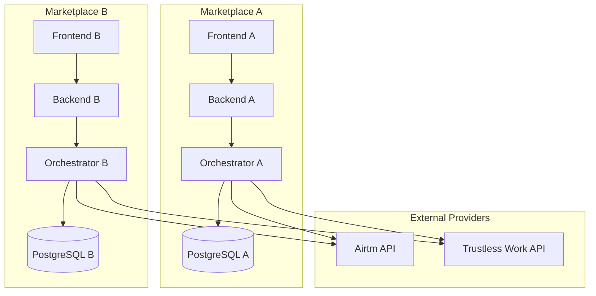
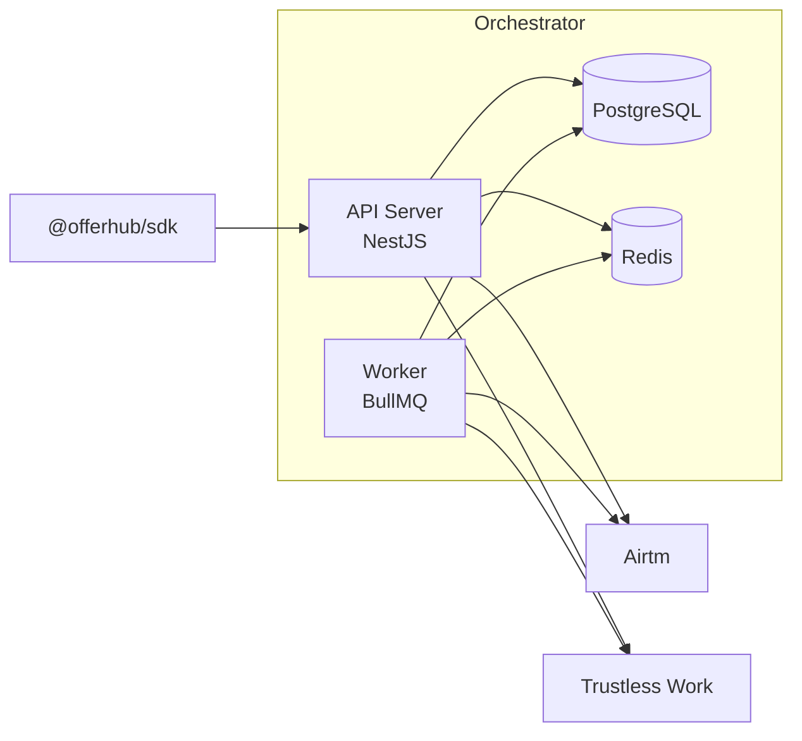
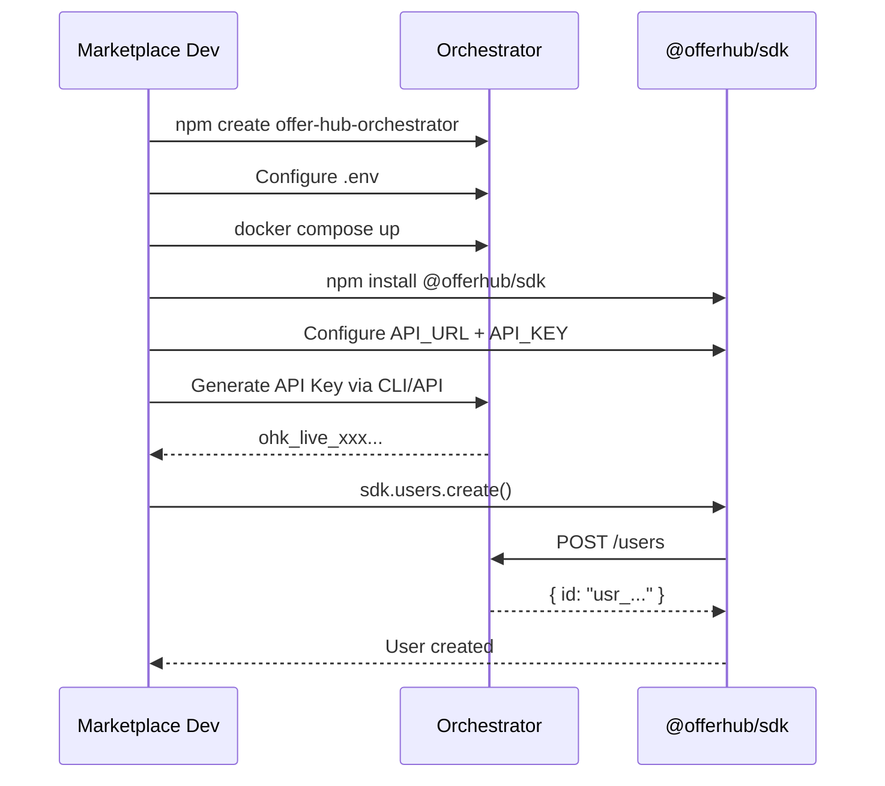

# Architecture Overview

## System Pyramid

```
┌─────────────────────────────────────────────────────────────┐
│  [5] Marketplace UI (third-party)                           │
│      - Own Web2 frontend                                    │
│      - Integrates with @offerhub/sdk                        │
├─────────────────────────────────────────────────────────────┤
│  [4] @offerhub/sdk (NPM)                                    │
│      - Client that calls the Orchestrator                   │
│      - Hides Airtm/Trustless Work                           │
├─────────────────────────────────────────────────────────────┤
│  [3] OFFER-HUB Orchestrator (self-hosted)                   │
│      - API + Workers + DB                                   │
│      - State machine, idempotency, audit                    │
│      - Integrates Airtm + Trustless Work                    │
├─────────────────────────────────────────────────────────────┤
│  [2] Airtm                                                  │
│      - Per-user accounts and balances                       │
│      - Top-ups (payins) and withdrawals (payouts)           │
├─────────────────────────────────────────────────────────────┤
│  [1] Trustless Work                                         │
│      - Non-custodial escrow (Stellar USDC)                  │
│      - Release / Refund / Dispute                           │
└─────────────────────────────────────────────────────────────┘
```

## Self-Hosted Model

Each marketplace runs its own Orchestrator instance:



### Self-Host Advantages

| Aspect | Benefit |
|---------|-----------|
| Data | Each marketplace controls its data |
| Compliance | Independent regulatory compliance |
| Scalability | Scale by your own demand |
| Customization | Instance-specific configuration |
| Latency | Deploy close to users |

## System Actors

### End Users

| Actor | Description |
|-------|-------------|
| **Buyer** | Buys services/products, tops up balance, pays orders |
| **Seller** | Sells services/products, receives payments, withdraws funds |

### Operators

| Actor | Description |
|-------|-------------|
| **Marketplace Admin** | Configures the instance, generates API keys |
| **Support Agent** | Resolves disputes, manages cases |

### Systems

| Actor | Description |
|-------|-------------|
| **Orchestrator API** | Processes marketplace requests |
| **Worker** | Processes async jobs (webhooks, reconciliation) |
| **Airtm** | Fiat payments provider |
| **Trustless Work** | Blockchain escrow provider |

## Orchestrator Components



### API Server

- Exposes REST endpoints
- Handles authentication and authorization
- Validates input and applies business rules
- Emits events
- Serves SSE for real-time

### Worker

- Processes provider webhooks
- Runs periodic reconciliation
- Handles retries for failed operations
- Processes deferred jobs

### PostgreSQL

- Stores entity state
- Audit logs
- Idempotency keys
- Configuration

### Redis

- Idempotency cache
- Job queues (BullMQ)
- Pub/sub for SSE

## Non-Negotiable Technical Principles

### 1. Required Self-Host

Each marketplace deploys its own instance. There is no centralized SaaS.

### 2. Per-User Funds (Not Pooled)

The Airtm balance is in the user name, not the marketplace. This:
- Reduces regulatory risk
- Simplifies reconciliation
- Protects the user

### 3. Non-Custodial Escrow

Trustless Work manages funds on-chain:
- The Orchestrator does NOT have access to private keys
- Funds are held in smart contracts
- Release/refund requires contract signatures

### 4. Required Idempotency

All POSTs that mutate state accept `Idempotency-Key`:
- Prevents duplicate operations
- Enables safe retries
- Simplifies integration

### 5. Required Correlation

Everything has traceable IDs:
- `order_id` <-> `escrow_id`
- `topup_id` <-> `airtm_payin_id`
- `withdrawal_id` <-> `airtm_payout_id`
- `request_id` for debugging

### 6. Server-Side Secrets

Airtm and Trustless Work keys live ONLY in the Orchestrator `.env`:
- Never exposed to the frontend
- Never in logs
- Never in responses

## Implementation Flow for Marketplaces



## Next Reading

- [State Machines](./state-machines.md) - States for each entity
- [Flow of Funds](./flow-of-funds.md) - How money flows
