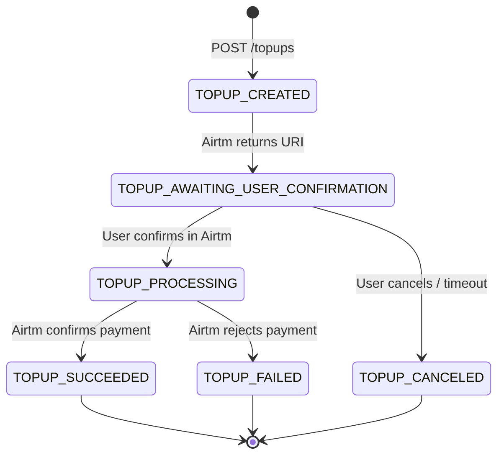
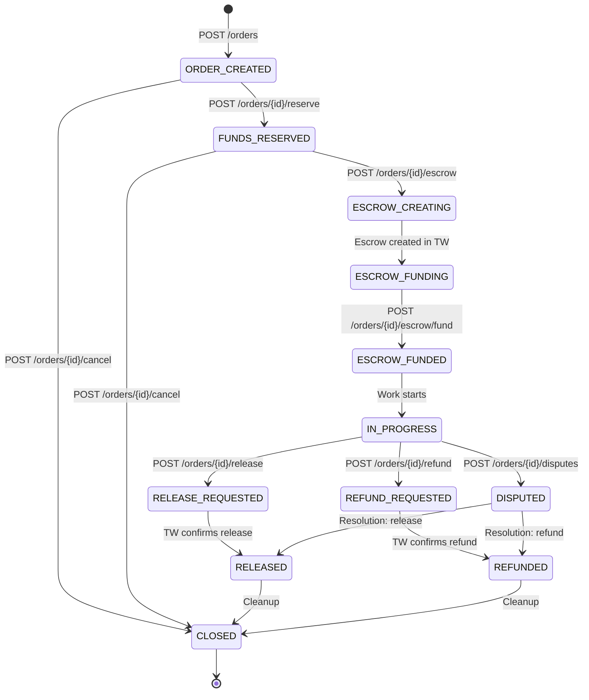
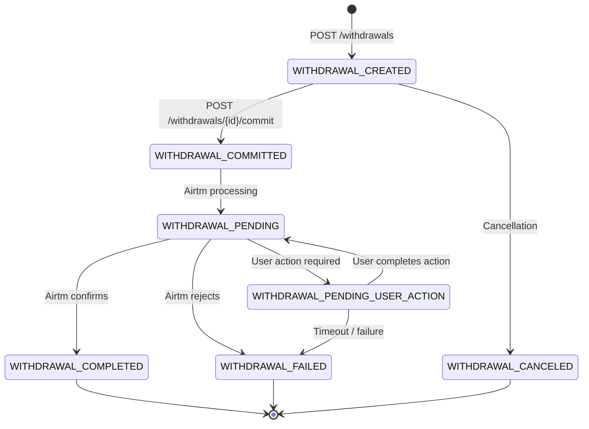
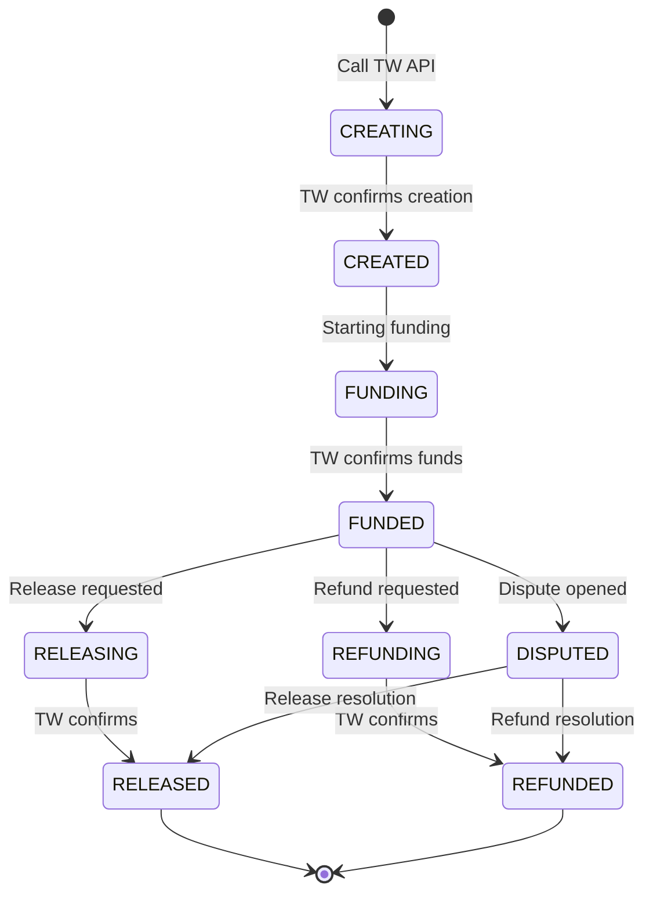
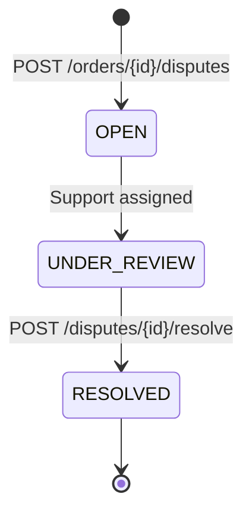

# State Machines

## TopUp States

States for balance top-ups via Airtm.



| State | Description |
|--------|-------------|
| `TOPUP_CREATED` | Top-up started, waiting to generate confirmation URI |
| `TOPUP_AWAITING_USER_CONFIRMATION` | URI generated, waiting for user confirmation in Airtm |
| `TOPUP_PROCESSING` | User confirmed, Airtm processing payment |
| `TOPUP_SUCCEEDED` | Payment succeeded, balance updated |
| `TOPUP_FAILED` | Payment failed (rejected, error, etc.) |
| `TOPUP_CANCELED` | Canceled by user or timeout |

### Terminal States

- `TOPUP_SUCCEEDED`
- `TOPUP_FAILED`
- `TOPUP_CANCELED`

---

## Order States

States for buy/sell orders.



| State | Description |
|--------|-------------|
| `ORDER_CREATED` | Order created off-chain, no funds reserved |
| `FUNDS_RESERVED` | Buyer balance reserved (logical hold) |
| `ESCROW_CREATING` | Creating escrow contract in Trustless Work |
| `ESCROW_FUNDING` | Funding escrow with reserved balance |
| `ESCROW_FUNDED` | Escrow funded, funds locked on-chain |
| `IN_PROGRESS` | Work in progress |
| `RELEASE_REQUESTED` | Release requested for the seller |
| `RELEASED` | Funds released to the seller |
| `REFUND_REQUESTED` | Refund requested for the buyer |
| `REFUNDED` | Funds returned to the buyer |
| `DISPUTED` | Dispute opened, flow frozen |
| `CLOSED` | Order completed |

### Valid Transitions

```typescript
const ORDER_TRANSITIONS = {
  ORDER_CREATED: ['FUNDS_RESERVED', 'CLOSED'],
  FUNDS_RESERVED: ['ESCROW_CREATING', 'CLOSED'],
  ESCROW_CREATING: ['ESCROW_FUNDING'],
  ESCROW_FUNDING: ['ESCROW_FUNDED'],
  ESCROW_FUNDED: ['IN_PROGRESS'],
  IN_PROGRESS: ['RELEASE_REQUESTED', 'REFUND_REQUESTED', 'DISPUTED'],
  RELEASE_REQUESTED: ['RELEASED'],
  REFUND_REQUESTED: ['REFUNDED'],
  DISPUTED: ['RELEASED', 'REFUNDED'],
  RELEASED: ['CLOSED'],
  REFUNDED: ['CLOSED'],
  CLOSED: [],
};
```

### Terminal States

- `CLOSED` (only terminal state)

### Business Rules

1. **Cancel only pre-escrow**: Can only cancel in `ORDER_CREATED` or `FUNDS_RESERVED`
2. **One dispute per order**: Cannot open another dispute if one is active
3. **Release/Refund are exclusive**: Once one starts, you cannot switch to the other

---

## Withdrawal States

States for withdrawals via Airtm.



| State | Description |
|--------|-------------|
| `WITHDRAWAL_CREATED` | Withdrawal started, waiting for commit |
| `WITHDRAWAL_COMMITTED` | Commit done, waiting for processing |
| `WITHDRAWAL_PENDING` | Airtm processing withdrawal |
| `WITHDRAWAL_PENDING_USER_ACTION` | User action required (KYC, verification) |
| `WITHDRAWAL_COMPLETED` | Withdrawal completed successfully |
| `WITHDRAWAL_FAILED` | Withdrawal failed |
| `WITHDRAWAL_CANCELED` | Withdrawal canceled |

### Terminal States

- `WITHDRAWAL_COMPLETED`
- `WITHDRAWAL_FAILED`
- `WITHDRAWAL_CANCELED`

---

## Escrow States (internal)

Escrow states in Trustless Work (mirrored locally).



| State | Description |
|--------|-------------|
| `CREATING` | Creating contract in Trustless Work |
| `CREATED` | Contract created, not funded |
| `FUNDING` | Funding contract |
| `FUNDED` | Funds locked in contract |
| `RELEASING` | Releasing funds to the seller |
| `RELEASED` | Funds released |
| `REFUNDING` | Returning funds to the buyer |
| `REFUNDED` | Funds returned |
| `DISPUTED` | Active dispute |

---

## Dispute States (internal)



| State | Description |
|--------|-------------|
| `OPEN` | Dispute opened, awaiting review |
| `UNDER_REVIEW` | Support reviewing the case |
| `RESOLVED` | Dispute resolved (release/refund/split) |

---

## Balance States (conceptual)

A user balance has two components:

```typescript
interface Balance {
  available: string;  // Available to use
  reserved: string;   // Reserved in active orders
}
```

### Balance Transitions

| Operation | Effect |
|-----------|--------|
| Top-up succeeded | `available += amount` |
| Reserve (order) | `available -= amount`, `reserved += amount` |
| Cancel (pre-escrow) | `available += amount`, `reserved -= amount` |
| Fund escrow | `reserved -= amount` (funds go on-chain) |
| Release | Seller: `available += amount` |
| Refund | Buyer: `available += amount` |
| Withdrawal created | `available -= amount` |
| Withdrawal failed/canceled | `available += amount` |
